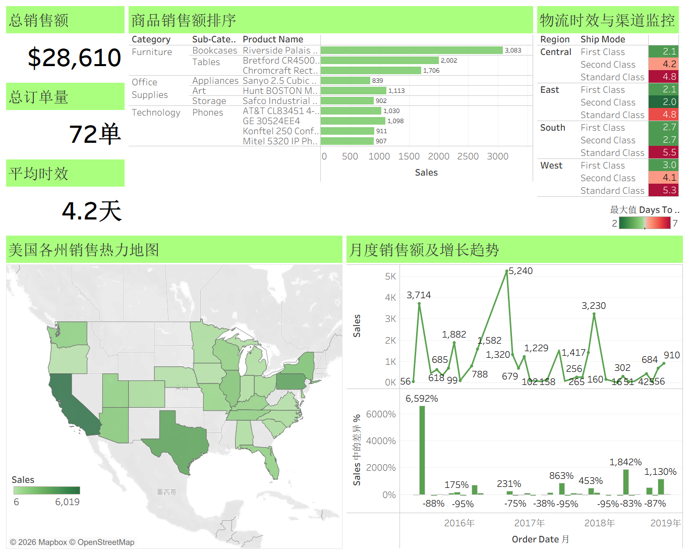

# 超市核心经营与物流时效监控

> 项目概述
本项目基于全渠道零售超市的交易样本数据（https://www.kaggle.com/datasets/abubakerasiel/super-market-analyses）
> 独立完成了从**底仓数仓清洗、高级业务逻辑计算（同环比/TopN排序/配送时效分析）到 Tableau 可视化大屏开发**的全链路商业流程。

## 🛠️ 技术栈
* **数据清洗与分析**：MySQL 8.0 
* **可视化**：Tableau Desktop 

## 项目文件树
```text
├── sql/
│   ├── data_cleaning.sql         # 数据清洗：标准化日期格式、缺失值/异常值处理、构建底表
│   ├── calc_mom_yoy.sql          # 核心业务：基于窗口函数(LAG)的月度营收同比与环比增长率计算
│   ├── shipping_performance.sql  # 供应链：各区域、不同运输渠道的平均发货时效与 SLA 诊断
│   └── top5_products.sql         # 货品策略：应用 DENSE_RANK() 挖掘各子品类畅销商品 Top 5
└── tableau/
    └── Supermarket_Operations_Dashboard.twbx  # Tableau 打包工作簿
```

## Dashboard 展示图

